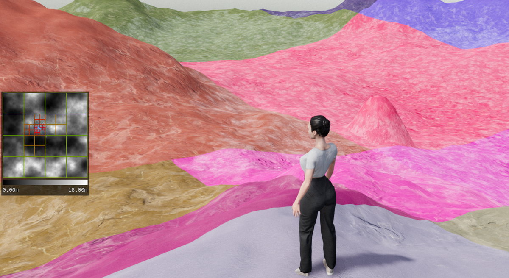
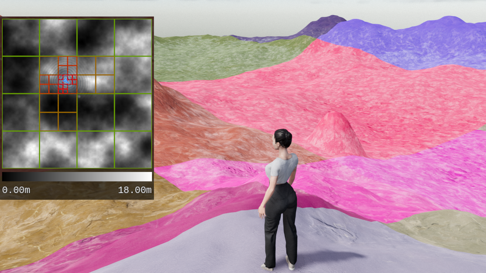
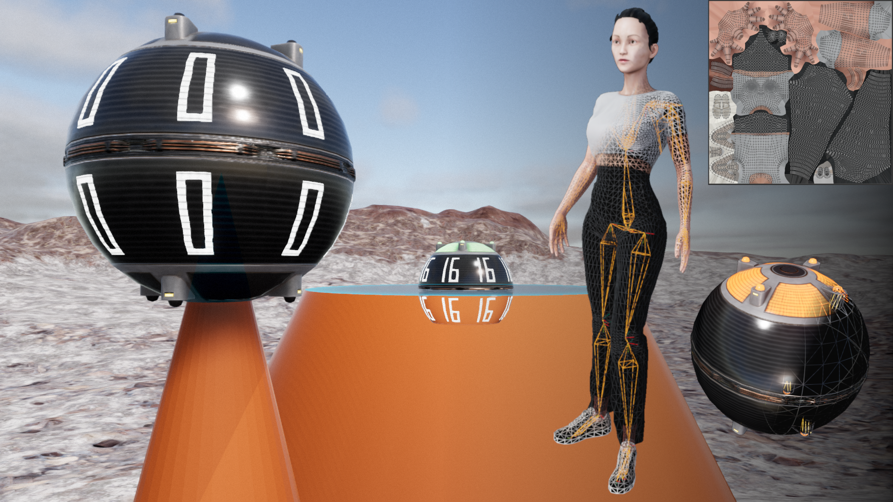

# Terrain Designer

Terrain Designer is a 3D application that lets you walk around a landscape and modify it interactively. 
It is made using the Godot game engine. 

# General Concept

- Terrain is represented by a heightmap (single source of truth).
- Placable spheres represent geometry that can modify the terrain.
- User can interact with spheres in real time.
- To apply modifications to the terrain, heightmaps representing different modifications get blended together.
- After modifications, the terrain mesh proceeds as before, but now samples a modified heightmap.

# Technical Overview

- Application written in C# using Godot Open Source Game Engine v.4.2.1 for rendering and collisions.
- Real time performance even with large terrains was a main goal.
- Large meshes maintain good performance by using a quadtree to continually adjust the mesh fidelity around the user and efficiently reduce hardware load.
- Additional performance optimizations were: staggering of updates to various objects and pre-allocation of arrays with objects that are continuosly re-use of objects
- Single main loop that calls all other update functions to make the control flow obvious and prevent race conditions.
- Code is separated into components that deal with contained tasks, e.g. terrain generation, updating spheres and their geometry, updating the 3D character, etc.
- Representation of geometry using signed distance fields to get exact representations that are easy to story and modify.
- Terrain shader made to be adaptive to any type of geometry by using height based texture blending, triplanar UV mapping and texture bombing.

# Credits

The code and assets were entirely created by Alexander Boehm. 
3D models were created using Blender, ZBrush and Marvelous Designer. 
Textures were made using Substance Designer, assets were textured using Substance Painter and Blender. 
Some textures, such as those for the terrain and UI are created in code at runtime of the application. 

