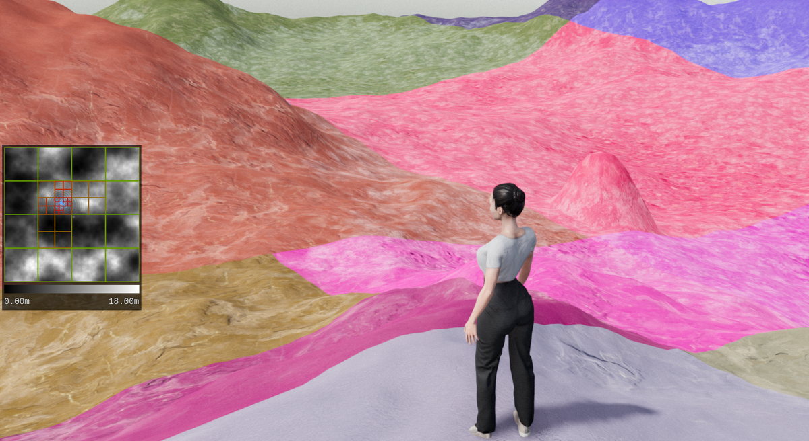

# Terrain Designer

Terrain Designer is a 3D application that lets you walk around a landscape and modify it interactively.
It is made using the Godot game engine.

# General Concept

- Terrain as heightmap
- spheres represent geometry
- user can interact with spheres
- apply terrain -> blend heightmaps of spheres with terrain and update

# Technical Overview

- using godot v.4.2.1 using C#
- performance a main goal
- Performance through QuadTree, staggering of updates and re-use of objects
- MainLoop
- Different components
- representation of sphere geometry using signed distance fields
- terrain shader made to be adaptive to any type of geometry using: height based blending, triplanar UV mapping, texture bombing

# Credits

The code and assets were entirely created by Alexander Boehm.
3D models were created using Blender, ZBrush and Marvelous Designer.
Textures were made using Substance Designer, assets were textured using Substance Painter and Blender.
Some textures, such as those for the terrain and UI are created in code at runtime of the application.
