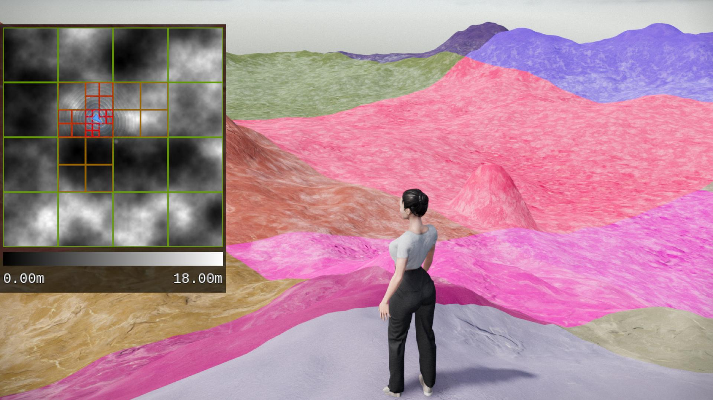

# Terrain Designer

Terrain Designer is a 3D application that lets you walk around a landscape and modify it interactively. 
The application is made entirely by Alexander Boehm and uses the Godot open source game engine for rendering and collisions. No external libraries were used. 

# General Concept

- Terrain is represented by a heightmap.
- Placeable spheres represent geometry that can modify the terrain.
- User can interact with spheres in real time.
- To apply modifications to the terrain, heightmaps representing different modifications get blended together.
- After modifications, the terrain samples an updated heightmap.

# Technical Overview

- Application written in C# using Godot v.4.2.1 for rendering and collisions.
- Real time performance even with large terrains was a main goal.
- Large meshes maintain good performance by using a custom quadtree implementation to continuously adjust the mesh resolution around the camera and effectively reduce hardware load (mesh tiles farther away from the camera are larger with a lower resolution than those closer to the camera).
- Additional performance optimizations were: staggering updating of objects across multiple frames to avoid lag spikes caused by multiple heavy calculations per frame; pre-allocation of arrays with objects on startup that are continuosly reused to avoid creating objects at run-time as much as possible which can lead to unpredictable performance impacts.
- Single main loop that initializes objects and calls all other update functions to make the control flow obvious and prevent race conditions.
- Code is separated into components that deal with specific tasks, e.g. terrain generation, updating spheres and their geometry, updating the 3D character, etc.
- Representation of 3D geometry using 2D signed distance fields to get exact representations that are easy to store and modify.
- Terrain shader made to be adaptive to any type of geometry by using height based texture blending, triplanar UV mapping and texture bombing.
- Runtime Profiling implemented as main tool to assess performance of code and algorithms, this was fundamental for assessing the effectiveness of my optimizations based on real, collected data.

# Assets and Motivation
The code (~8000 lines) and assets were entirely created by Alexander Boehm. 
3D models were created using Blender, ZBrush and Marvelous Designer. 
Textures were made using Substance Designer, assets were textured using Substance Painter and Blender. 
Some textures, such as those for the terrain and UI are created in code at runtime of the application. 
 
I made this application to help me learn how to implement complex, interrelated systems that consistently have to perform well to ensure a smooth user experience. 
The functionality that I implemented is limited in scope but still allowed me enough space to try out various implementations of the ideas I had. It also let me push the final product far enough to produce a polished result that shows a variety of skills. 

