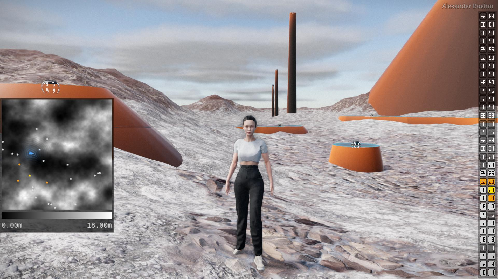
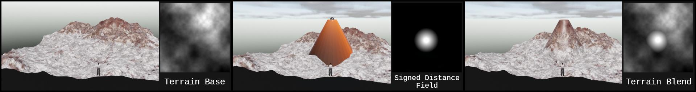

# Terrain Designer

Terrain Designer is a 3D application that lets you walk around a landscape and modify it interactively and in real-time.  
Terrain generation and modification is handled with custom code that you can find here.  

See it in action: www.youtube.com/yC8pnw11yRI  

# General Concept

- Terrain is represented by a heightmap.
- Spheres serve as control points for new geometry that can modify the terrain.
- Place and interact with spheres in real-time.
- To apply modifications to the terrain, heightmaps representing different modifications get blended together.
- After modifications, the terrain samples an updated heightmap.

# Technical Overview

- Application written in C# (~8000 lines) using the Godot game engine v.4.2.1 for rendering and collisions. No external libraries were used.
- Real-Time performance even with large terrains was a main goal.
- Large meshes represented by a custom quadtree implementation to continuously adjust the mesh resolution around the camera and efficiently reduce hardware load.
- Staggered resampling of mesh tiles across multiple frames to avoid lag spikes.
- Pre-allocation of arrays with objects that are continuosly re-used.
- Single main loop that initializes objects and calls all other update functions to make the control flow obvious and prevent race conditions.
- Code is separated into components, e.g. terrain generation, updating spheres and their geometry, updating the 3D character, etc.
- Representation of geometry using signed distance fields to get exact representations that are easy to store, modify and visualize.
- Adaptive terrain shader that works with any type of geometry by using height based texture blending, triplanar UV mapping and texture bombing.
- Custom real-time profiler to assess performance of code and algorithms. This was fundamental for assessing the effectiveness of my optimizations based on actual data.

# Credits and Motivation
The code and assets were entirely created by Alexander Boehm. Textures and models were created from scratch. 
3D models were created using Blender, ZBrush and Marvelous Designer. 
Textures were made using Substance Designer, assets were textured using Substance Painter and Blender. 
Some textures, such as those for the terrain and UI are created in code at runtime of the application. 
 
I made this application to help me learn how to implement complex, interrelated systems that consistently have to perform well to ensure a smooth user experience. 
The functionality that I implemented is limited in scope but still allowed me enough space to try out various implementations of the ideas I had. It also let me push the final product far enough to produce a polished result that shows a variety of skills. 
 
For a more detailed explanation, take a look at my [website](https://axboehm.com/worksTD.html#td).  

